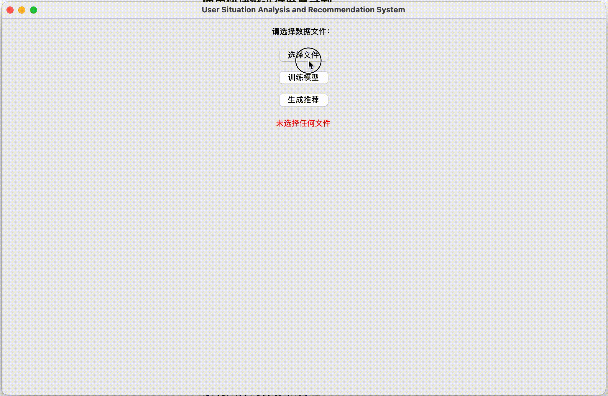

~~~~~~~~~~~~~~~~~~~step~~~~~~~~~~~~~~~~~~~~~~~~~~~~~~~~~~~~~~~~~~~~~~~~~
1:
 python3 -m venv venv
2:
 source venv/bin/activate（win: .\venv\Scripts\Activate ）

3:
 pip install -r requirements.txt

4:
 pypthon3 main.py

~~~~~~~~~~~~~~~Execute shell command in root directory～～～～～～～～～～～～～～
~~~~~~~~~~~~~~~在根目录下执行shell命令~~~~~~~~~~~~~~~~~~~~~~~~~~~~~~~~~~~~~~~~~~~

~~~~~~~~~~~~~~~~例子比较简单，如果有需求，自己准备input数据与模型/The example is relatively simple. If necessary, prepare the input data and model yourself.--------------------

~~~~~~~~~~~~~~~~~~ ~~~~~~~~~~~~~~~~~~需求~~~~~~~~~~~~~~~~~~~~~~~~~~~~~~~~~~~~~~~~~~~~~~~~~~~~~~~~~~~
空战场交战态势信息自汇聚
Self-Aggregation of Air Battle Engagement Situational Information
内容及要求
Content and Requirements
1. 用户态势需求智能分析与生成技术研究
1. Research on Intelligent Analysis and Generation Technology of User Situation Needs
首先，我们要系统地整理用户所在行业或领域的专业知识，并搭建适合该领域的知识架构。这个过程需要理解用户的实践操作和工作任务等多元化信息；其次，根据不同用户角色、受领任务及过程等情境要素来动态感知用户需求，实现对用户决策问题的准确理解；然后从决策问题，映射出用户需要哪些类型、具有哪些特征的支持信息；运用智能化工具和技术（如智能分类、数据可视化等）构建用户需求模型，刻画用户的态势产品需求清单。
First, we need to systematically organize the professional knowledge in the user's industry or field and build a knowledge framework suitable for that field. This process requires understanding the diversified information of the user's practical operations and work tasks; then, according to different user roles, received tasks, and contextual elements, dynamically perceive user needs to accurately understand the user's decision-making problems; then map out the types and characteristics of support information users need from the decision-making problems; use intelligent tools and technologies (such as intelligent classification, data visualization, etc.) to build user needs models and outline the list of user situational product needs.
2. 融合态势需求模型和个人历史信息的个性化推荐算法模型研究
2. Research on Personalized Recommendation Algorithm Model Integrating Situational Needs Model and Personal Historical Information
基于研究内容一生成的用户态势信息需求清单，以及收集到的符合实际特征分布的用户历史交互信息需求情况，基于深度学习原理的个性化推荐系统，匹配用户需求，能够为当前执行任务的用户推荐任务相关性的战场信息。
Based on the user situational information needs list generated in Research Content One, and the collected user historical interaction information needs that meet the actual characteristic distribution, a personalized recommendation system based on deep learning principles can match user needs and recommend task-related battlefield information for users currently performing tasks.
主要指标
Main Indicators
1. 能够根据任务阶段实时生成关键态势信息需求清单
1. Able to generate a list of key situational information needs in real-time according to the task stage
2. 能够动态自主推荐与任务相关联、用户感兴趣的战场态势信息，准确率和召回率相较现有主流方法有所提升。
2. Able to dynamically and autonomously recommend battlefield situational information related to the task and of interest to the user, with improved accuracy and recall compared to existing mainstream methods.
数据收集与预处理，设计系统的大体框架建立，初步用户界面和交互设计，推荐算法技术的大体思路，用户需求的分析，个性化推荐算法模型的建立原型系统开发
Data collection and preprocessing, establishing the overall framework of the system design, initial user interface and interaction design, general idea of recommendation algorithm technology, analysis of user needs, development of a prototype system for personalized recommendation algorithm model
深度学习技术的应用使用深度学习模型提高推荐的准确性，模型的训练与优化，实时反馈的调整，完善数据集和数据处理
Application of deep learning technology to improve the accuracy of recommendations using deep learning models, model training and optimization, real-time feedback adjustment, and improvement of datasets and data processing
模型开发和优化
Model development and optimization
用户界面和用户体验（UX）改进
User interface and user experience (UX) improvement
系统的可靠性和稳定性
System reliability and stability
设计具有容错机制的系统架构，采用分布式计算和存储来提高系统的健壮性。
Design a system architecture with fault tolerance mechanisms and use distributed computing and storage to enhance system robustness.
进行压力测试，以确保系统在高负载下也能稳定运行。
Conduct stress testing to ensure the system can operate stably under high load.
用户界面和交互
User interface and interaction
采用用户中心设计（UCD）原则，与潜在用户合作设计界面，并进行用户测试以收集反馈，以此来改进用户界面和体验。
Adopt User-Centered Design (UCD) principles, collaborate with potential users to design the interface, and conduct user testing to collect feedback to improve the user interface and experience.
优化推荐系统的交互设计
Optimize the interaction design of the recommendation system
继续迭代用户界面设计，根据用户反馈调整布局和交互逻辑。运用现代UI/UX设计原则和工具，例如使用动态视觉元素和响应式设计提高用户界面的吸引力和响应性。
Continue iterating on user interface design, adjusting layout and interaction logic based on user feedback. Apply modern UI/UX design principles and tools, such as using dynamic visual elements and responsive design to enhance the attractiveness and responsiveness of the user interface.

-------------------------------------flow-------------------------------------------------------------------------------------------------------------------------

用户态势需求智能分析与生成技术研究  
**Research on Intelligent Analysis and Generation Technology of User Situation Needs**

整理专业知识并搭建知识架构：  
**Organize professional knowledge and build a knowledge framework:**  
数据预处理脚本 data_preprocessing.py 用于处理原始数据并将其转换为可用的格式，适用于不同的用户角色和任务。  
**The data preprocessing script data_preprocessing.py is used to process raw data and convert it into a usable format, suitable for different user roles and tasks.**

动态感知用户需求：  
**Dynamically perceive user needs:**  
使用 RecommendationModel 模型来分析用户的历史数据，并生成符合用户需求的态势信息。  
**Use the RecommendationModel to analyze users' historical data and generate situational information that meets their needs.**

构建用户需求模型：  
**Build a user needs model:**  
generate_recommendations.py 脚本会根据用户的当前任务阶段和历史数据生成个性化推荐。  
**The generate_recommendations.py script generates personalized recommendations based on the user's current task stage and historical data.**

融合态势需求模型和个人历史信息的个性化推荐算法模型研究  
**Research on the integration of situational needs model and personalized recommendation algorithm model with personal historical information**

个性化推荐系统：  
**Personalized recommendation system:**  
使用深度学习技术构建的 RecommendationModel 可以处理用户历史数据并生成个性化的推荐。  
**The RecommendationModel constructed using deep learning technology can process users' historical data and generate personalized recommendations.**

匹配用户需求：  
**Match user needs:**  
推荐系统通过模型训练和评估脚本 train_model.py 实现。  
**The recommendation system is implemented through the model training and evaluation script train_model.py.**

主要指标:  
**Main indicators:**

实时生成关键态势信息需求清单：  
**Generate a list of key situational information needs in real-time:**  
数据预处理和推荐生成脚本实现了这一功能。  
**This is achieved through data preprocessing and recommendation generation scripts.**

动态自主推荐：  
**Dynamic autonomous recommendation:**  
模型的 predict 方法根据用户数据生成推荐，且模型的准确性和召回率通过测试脚本 test_recommendation_model.py 进行验证。  
**The model's predict method generates recommendations based on user data, and the accuracy and recall rate of the model are verified through the test script test_recommendation_model.py.**

数据收集与预处理  
**Data collection and preprocessing**

数据预处理脚本 data_preprocessing.py 负责数据的收集和标准化处理。  
**The data preprocessing script data_preprocessing.py is responsible for data collection and standardization processing.**

设计系统的大体框架建立  
**Establish the overall framework for system design**

项目文件夹结构 提供了清晰的框架，包括数据、模型、脚本和测试文件夹。  
**The project folder structure provides a clear framework, including data, models, scripts, and test folders.**

初步用户界面和交互设计  
**Preliminary user interface and interaction design**

目前的代码中未包含具体的用户界面设计，但可以在后续迭代中添加。  
**The current code does not include a specific user interface design, but it can be added in subsequent iterations.**

推荐算法技术的大体思路  
**General idea of recommendation algorithm technology**

模型 RecommendationModel 基于深度学习技术，使用Keras构建，并在 train_model.py 中进行训练和优化。  
**The RecommendationModel is based on deep learning technology, constructed using Keras, and trained and optimized in train_model.py.**

用户需求的分析  
**Analysis of user needs**

数据预处理和推荐生成脚本 已包含用户需求分析和建模的初步实现。  
**The data preprocessing and recommendation generation scripts already include the preliminary implementation of user needs analysis and modeling.**

个性化推荐算法模型的建立原型系统开发  
**Development of a prototype system for personalized recommendation algorithm models**

RecommendationModel 提供了基础的个性化推荐算法实现。  
**The RecommendationModel provides a basic implementation of personalized recommendation algorithms.**

系统的可靠性和稳定性  
**System reliability and stability**

代码结构清晰，模块化设计，便于后续扩展和维护。  
**The code structure is clear, with modular design, which is convenient for subsequent expansion and maintenance.**

用户界面和用户体验（UX）改进  
**User interface and user experience (UX) improvement**

包含具体的UI/UX设计，但可以在后续迭代中添加。  
**Includes specific UI/UX design, but can be added in subsequent iterations.**
# UserSituationAnalysis
